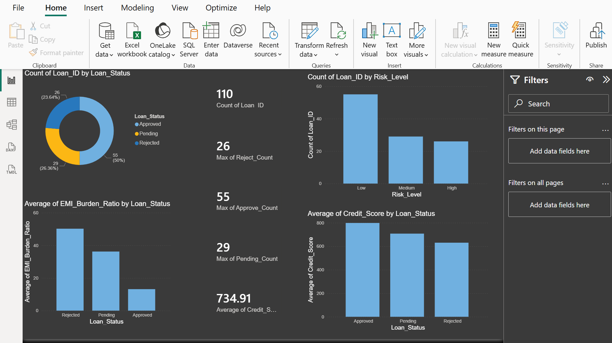
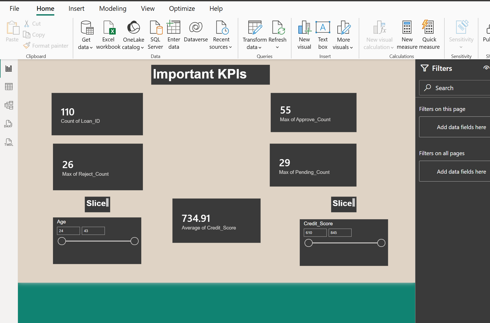
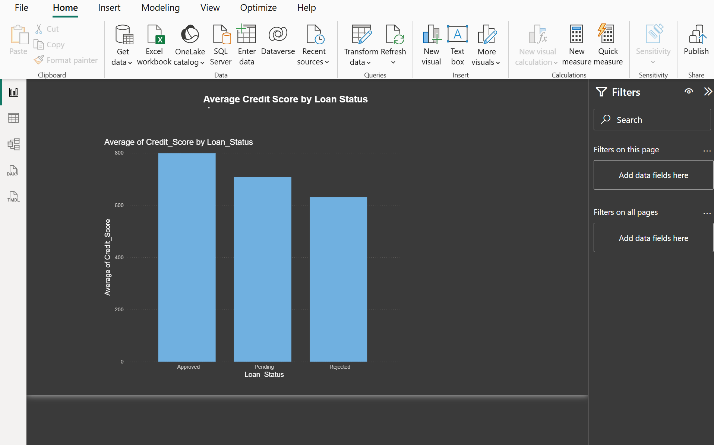
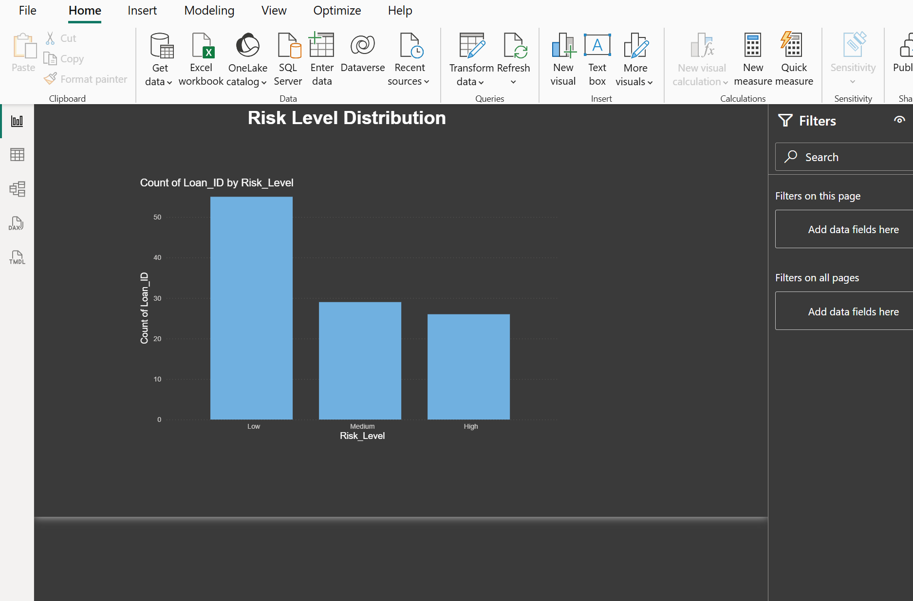
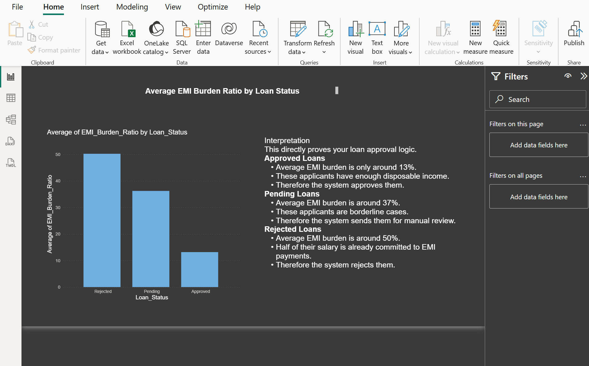

# 📊 POWER BI Loan Analytics Dashboard

## 📌 Project Overview

The **Power BI Loan Analytics Dashboard** is a comprehensive data visualization project designed to analyze loan applications, customer credit profiles, risk levels, and approval trends. The dashboard transforms raw financial and customer data into meaningful insights that help financial institutions make informed lending decisions.

This project demonstrates the use of Power BI for creating interactive dashboards, KPI tracking systems, risk assessment visualizations, and loan portfolio analysis.

---

## 🎯 Objectives

- Analyze loan applicant data efficiently.
- Monitor credit score distributions.
- Evaluate customer risk levels.
- Track loan approval and rejection patterns.
- Visualize key financial KPIs.
- Support data-driven lending decisions.

---

## ✨ Key Features

### 📈 Interactive Dashboard
- Dynamic filtering and drill-down analysis.
- User-friendly interface.
- Real-time performance indicators.

### 💳 Credit Score Analysis
- Average credit score tracking.
- Customer creditworthiness insights.
- Credit distribution visualization.

### ⚠️ Risk Assessment
- Risk categorization of applicants.
- High-risk vs low-risk customer analysis.
- Portfolio risk monitoring.

### 📋 Loan Status Monitoring
- Approved loans tracking.
- Rejected loans analysis.
- Pending applications overview.

### 📊 KPI Monitoring
- Total Applications
- Approval Rate
- Average Loan Amount
- Average Credit Score
- Risk Metrics

---

# 🖼 Dashboard Screenshots

## 📊 Complete Dashboard



---

## 📈 Key Performance Indicators (KPIs)



---

## 💳 Average Credit Score Analysis



---

## 📋 Loan Status Distribution


---

## ⚠️ Risk Level Analysis



---

## 🌍 EMI Ratio Analysis



---

# 📂 Repository Structure

```text
POWERBI-DASHBOARD/
│
├── DASHBORAD.FULL.png
├── KPIs.png
├── AVERAGECREDITSCORE.png
├── LOANSTATUS.png
├── RISKLEVEL.png
├── EMIRATIO.png
└── README.md
```

---

# 🛠 Technologies Used

| Technology | Purpose |
|------------|----------|
| Power BI | Dashboard Development |
| Data Modeling | Relationship Management |
| DAX | Calculated Measures & KPIs |
| Excel/CSV Dataset | Data Source |
| Data Visualization | Business Insights |

---

# 📊 Dashboard Insights

### Customer Credit Analysis
- Understand average customer credit scores.
- Identify financially healthy borrowers.

### Loan Portfolio Monitoring
- Track loan approval and rejection trends.
- Evaluate lending performance.

### Risk Management
- Detect high-risk applicants.
- Improve loan decision accuracy.

### EMI Ratio Evaluation
- Analyze customer repayment capacity.
- Support responsible lending practices.

---

# 🚀 Business Impact

This dashboard helps financial institutions:

- Improve lending decisions.
- Reduce default risks.
- Enhance portfolio management.
- Monitor operational KPIs.
- Generate actionable insights from customer data.

---

# 🔮 Future Enhancements

- Predictive Loan Approval Models.
- AI-powered Risk Scoring.
- Real-Time Data Integration.
- Automated Reporting.
- Customer Segmentation Analysis.

---

# 👨‍💻 Author

**Aakash Malhotra**

Finance & Data Analytics Enthusiast

- Power BI Developer
- Financial Analyst
- Business Intelligence Practitioner

---

# ⭐ Support

If you found this project useful, consider giving the repository a **Star ⭐** and sharing your feedback.

---

## 📜 License

This project is intended for educational and portfolio purposes.
